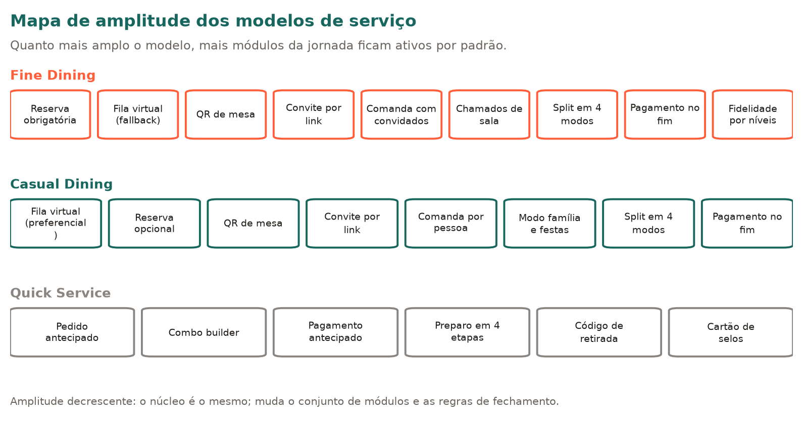
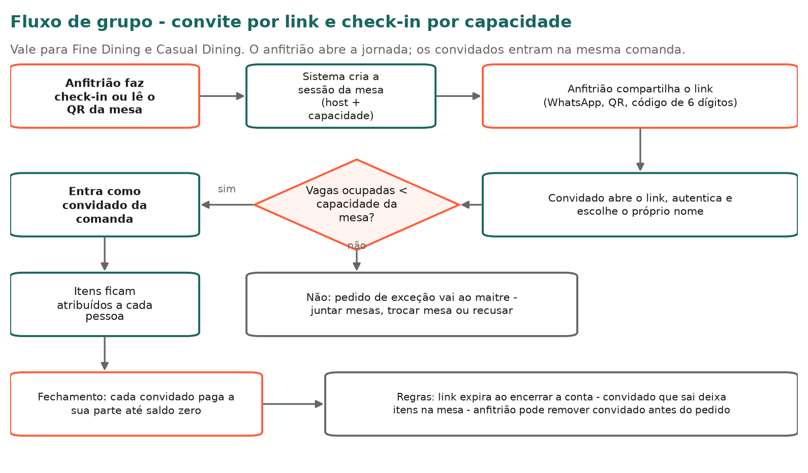
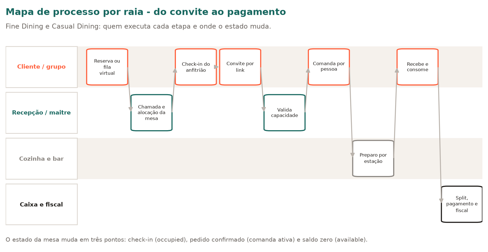
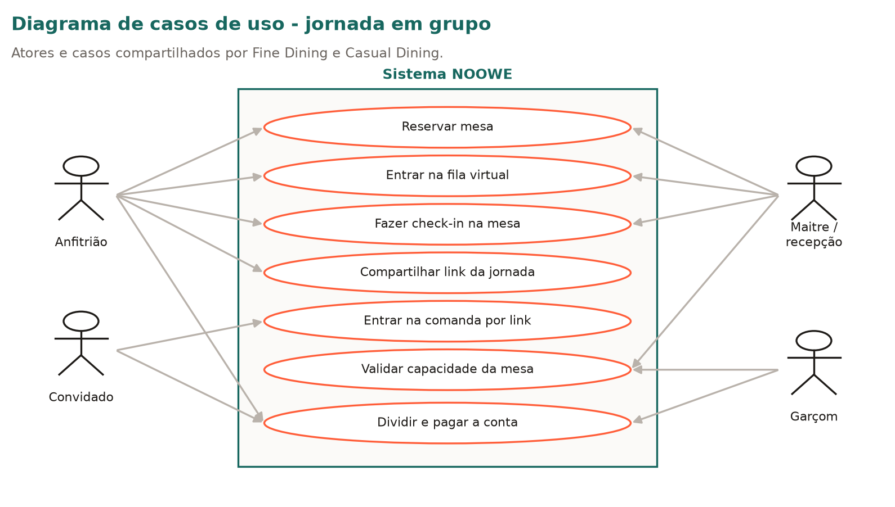
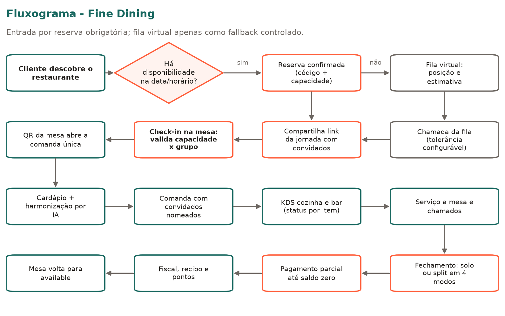
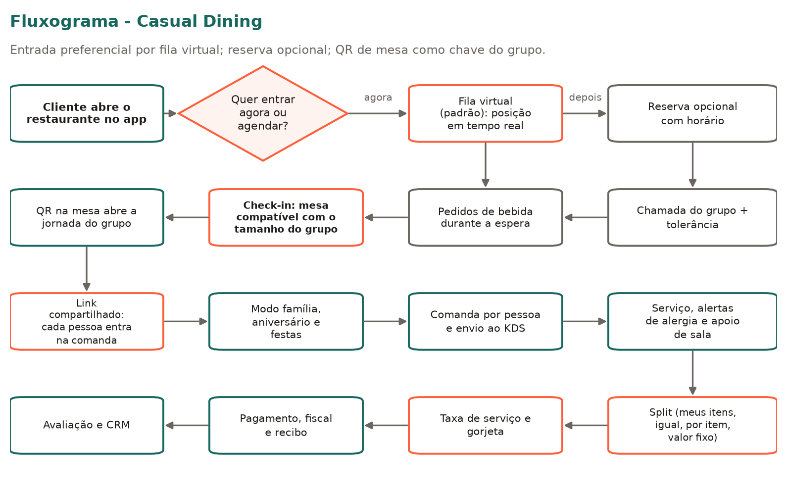
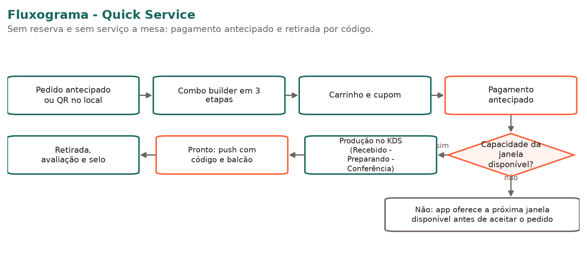

<!-- FONTE DA VERDADE. Convertido de NOOWE_Modelos_de_Servico_Fine_Casual_Quick_v2.docx (v2.0, set/2026).
     Não editar sem versionar. Fatias e ADRs referenciam este arquivo por número de seção. -->

# NOOWE — Modelos de Serviço: Fine Dining · Casual Dining · Quick Service

> **Os diagramas deste documento estão transcritos em Mermaid em [`fluxos.md`](fluxos.md).**
> Leia aquela versão: é legível por agente, versionável e permite diff. Os PNGs em
> `diagramas/` são referência visual apenas.
>
> Este arquivo é a **fonte da verdade**. As fatias em `docs/fatias/` referenciam suas seções
> por número em vez de copiar o texto — se você alterar algo aqui, verifique quais fatias
> citam a seção alterada.

A NOOWE

Onde cada experiência se encontra

Documento de Funcionamento e Implementação

Modelos de serviço: Fine Dining · Casual Dining · Quick Service

Versão 2.0 — Setembro de 2026

Inclui mapas de processo, fluxogramas, casos de uso, diferenciação de amplitude entre os modelos, convite por link e check-in por capacidade.

## Sumário

- 1. Introdução — objetivo, escopo e princípios comuns
- 1.4 Amplitude dos modelos — o que cada formato contempla
- 2. Arquitetura funcional comum — camadas, entidades, estados, papéis e eventos
- 2.6 Sessão de mesa, convite por link e capacidade — o motor da jornada em grupo
- 3. Fine Dining — jornada do cliente, operação, regras, exceções e aceite
- 4. Casual Dining — jornada do cliente, operação, regras, exceções e aceite
- 5. Quick Service — jornada do cliente, operação, regras, exceções e aceite
- 6. Comparativo entre os modelos e casos de uso consolidados
- 7. Requisitos de implementação — configuração, dados, tempo real, pagamentos
- 8. Faseamento de entrega, riscos e decisões em aberto

## 1. Introdução

### 1.1 Objetivo

Este documento descreve, em nível de implementação, como funcionam os três modelos de serviço hoje disponíveis na NOOWE: Fine Dining, Casual Dining e Quick Service. Para cada modelo estão detalhados: a jornada do cliente tela a tela, a jornada correspondente da operação por papel, as regras de negócio, o estado compartilhado entre cliente e restaurante, os eventos em tempo real, o modelo de dados necessário, os casos de exceção e os critérios de aceite.

O conteúdo foi derivado das jornadas já implementadas no produto (demos interativas e telas de operação) e organizado como especificação funcional, de modo que o time possa transformar cada fluxo em backlog, esquema de dados e testes.

### 1.2 Como ler

- Jornada do cliente: sequência canônica de telas, com a ação do usuário e o efeito no sistema.
- Jornada da operação: quem vê o quê, em qual tela, e qual decisão precisa tomar.
- Regras de negócio: comportamentos obrigatórios, cálculos e restrições.
- Modelo de dados e eventos: entidades, campos e mensagens que sustentam o fluxo.
- Critérios de aceite: o que precisa ser verdadeiro para considerar o fluxo entregue.

Convenção: valores numéricos citados (percentuais de serviço, descontos de combo, tempos de etapa) refletem a parametrização atual das jornadas do produto. Todos devem ser configuráveis por estabelecimento, nunca fixos em código.

### 1.3 Princípios comuns aos três modelos

- Um único núcleo, três configurações: o motor de pedidos, pagamentos, KDS e fidelidade é o mesmo; o modelo de serviço define quais módulos ficam ativos e quais regras se aplicam.
- Estado conectado: o que o cliente faz no app aparece imediatamente na operação (pedido, chamado, pagamento) e o que a operação faz aparece imediatamente no app (status, tempo, liberação de mesa).
- Sem retrabalho manual: nenhum pedido é redigitado. O pedido nasce digital e circula entre cliente, KDS, garçom, caixa e fiscal.
- O modelo de serviço é escolhido na configuração do estabelecimento e pode coexistir (ex.: um restaurante casual com balcão express).

### 1.4 Amplitude dos modelos — o que cada formato contempla

Os três modelos não são versões de tamanhos diferentes do mesmo fluxo: eles se distinguem pela amplitude da jornada que colocam nas mãos do cliente. A regra de leitura é simples — Fine Dining contempla a experiência mais ampla e completa; Casual Dining contempla a jornada completa com entrada mais fluida; Quick Service é uma jornada curta, transacional e sem serviço à mesa.

Mapa de amplitude dos modelos de serviço

| Dimensão de amplitude | Fine Dining | Casual Dining | Quick Service |
|---|---|---|---|
| Porta de entrada | Reserva obrigatória; fila virtual apenas quando a casa opera walk-in controlado | Fila virtual preferencial; reserva disponível como opção | Pedido antecipado pelo app ou QR no balcão |
| QR de mesa | Usado para associar o cliente à mesa reservada no check-in | Chave da jornada: abre a sessão da mesa e a comanda do grupo | Não se aplica (não há mesa) |
| Jornada em grupo | Completa e expansiva: convite por link, convidados nomeados, itens atribuídos, pagamento individual | Completa: convite por link, comanda por pessoa, festas e junção de mesas | Individual; um pedido, um pagador |
| Check-in | Obrigatório, valida reserva e capacidade da mesa | Obrigatório, valida tamanho do grupo contra a capacidade da mesa | Não existe check-in de mesa |
| Extensão da jornada | Todos os módulos ativos (harmonização, sommelier, chamados, split avançado, fidelidade por níveis) | Todos os módulos de sala ativos (espera com consumo, família, festas, split) | Módulos transacionais (combo, pagamento, preparo, retirada, selos) |
| Permanência típica | Longa, com ritual de serviço | Média, com foco em giro de mesa sem perder hospitalidade | Curta, otimizada por throughput |

Consequência de produto: Fine Dining é o superconjunto. Toda funcionalidade de Casual Dining existe também em Fine Dining, com regras mais rígidas de entrada. Quick Service é o subconjunto transacional. Isso permite implementar uma vez e habilitar por configuração.

## 2. Arquitetura funcional comum

### 2.1 Camadas

| Camada | Responsabilidade | Consumidores |
|---|---|---|
| App do cliente | Descoberta, cardápio, comanda/carrinho, pagamento, fidelidade, avaliação, suporte. | Cliente final (mobile e web/QR). |
| Painel de operação | Mesas, pedidos, aprovações, caixa, equipe, cardápio, relatórios. | Dono, gerente, maitre, garçom. |
| KDS (cozinha e bar) | Fila de tickets, timers, roteamento por estação, expedição. | Chef, cozinheiro, barman. |
| Núcleo de estado | Pedidos, mesas, reservas, notificações, fidelidade, analytics. | Todas as camadas, em tempo real. |
| Serviços externos | Pagamento (PIX, cartão, TAP to Pay), fiscal (NFC-e), push/e-mail, marketplaces. | Núcleo de estado. |

### 2.2 Entidades centrais

| Entidade | Campos essenciais | Observações |
|---|---|---|
| Order | id, tableNumber (ou pickupCode), items[], status, total, customerName, createdAt, updatedAt, isKitchen, isBar, source | source distingue app do cliente, garçom, QR, balcão e marketplace. |
| OrderItem | menuItem, quantity, notes, guestId (opcional), station, prepTime, itemStatus | guestId habilita comanda por pessoa e divisão por item. |
| Table | id, number, seats, status (available / occupied / reserved / billing), customerName, occupiedSince, orderTotal | Base do mapa de salão e do cálculo de giro. |
| Reservation | id, customerName, partySize, time, status (confirmed / seated / waiting / cancelled), phone, notes | Também usada para lista de espera quando status = waiting. |
| Guest | id, name, items atribuídos, paid (bool), shareAmount | Usada no fechamento de conta compartilhada. |
| Notification | id, type (new_order / waiter_call / reservation / payment / kitchen_ready), message, timestamp, read | Alimenta sino do painel, KDS e push do cliente. |
| LoyaltyAccount | clientId, points, tier, stamps, history[] | Pontos, níveis e cartão de selos coexistem no mesmo registro. |

### 2.3 Máquina de estado do pedido

O ciclo de vida canônico é: pending → confirmed → preparing → ready → delivered → paid. Cada modelo de serviço expõe ao cliente um recorte diferente dessa máquina:

| Modelo | Etapas visíveis ao cliente | Encerramento |
|---|---|---|
| Fine Dining | Recebido → Preparando → Pronto → Entregue | Pagamento após o consumo (conta fechada na mesa). |
| Casual Dining | Recebido → Preparando → Pronto → Entregue | Pagamento após o consumo, geralmente dividido. |
| Quick Service | Recebido → Preparando → Conferência → Pronto | Pagamento antecipado; encerramento na retirada. |

Regra transversal: o status do pedido é derivado do status dos itens. Um pedido só entra em ready quando todos os itens de todas as estações estão prontos (convergência). Itens de bar e cozinha são roteados em paralelo e reconvergem na expedição.

### 2.4 Papéis e visão por papel

| Papel | Tela inicial | Escopo de decisão |
|---|---|---|
| Dono | Dashboard executivo | KPIs, financeiro, cardápio, equipe, configuração. |
| Gerente | Painel operacional | Aprovações (cancelamento, cortesia, estorno, desconto), caixa, escala, estoque. |
| Maitre | Reservas e fluxo de salão | Alocação de mesas, fila virtual, check-in. |
| Chef | KDS cozinha | Fila de preparo, fichas técnicas, aprovações de menu, disponibilidade de itens. |
| Cozinheiro | Estação de preparo | Execução e baixa dos tickets da própria estação. |
| Barman | Estação do bar | Fila de bebidas, receitas, estoque de bar. |
| Garçom | Minhas mesas | Pedidos, chamados, ações na mesa, cobrança e gorjeta. |

### 2.5 Eventos em tempo real

| Evento | Origem | Destino e efeito |
|---|---|---|
| order.created | App do cliente, garçom ou balcão | KDS (novo ticket), painel de pedidos, notificação para o gerente. |
| order.item.status_changed | KDS / estação | App do cliente (progresso por item), garçom (expedição). |
| order.ready | KDS | Push ao cliente, alerta ao garçom, painel de expedição. |
| table.status_changed | Garçom, maitre ou pagamento | Mapa de mesas, fila virtual (libera próxima chamada). |
| waiter.call | App do cliente | Tela de chamados do garçom, com tipo e mesa. |
| payment.completed | Cliente ou TAP to Pay do garçom | Fechamento da conta, mesa para available, fiscal, fidelidade. |
| reservation.status_changed | Cliente ou maitre | Agenda do maitre, mapa de mesas, push ao cliente. |
| queue.position_changed | Motor de fila | Push ao cliente e painel de fluxo de salão. |

### 2.6 Sessão de mesa, convite por link e capacidade

Fine Dining e Casual Dining compartilham o mesmo motor de jornada em grupo. Ele resolve três perguntas: quem está na mesa, como alguém entra na jornada de quem já está e até quantas pessoas a mesa suporta.

Fluxo de grupo — convite por link e check-in por capacidade

#### Entidades adicionais

| Entidade | Campos essenciais | Função |
|---|---|---|
| TableSession | id, tableId, status (open / billing / closed), hostGuestId, capacity, occupiedSeats, openedAt, closedAt | Representa a visita em curso naquela mesa. É a raiz da comanda e do split. |
| GuestLink | id, sessionId, token, shortCode (6 dígitos), expiresAt, maxUses, createdBy, revoked | Convite compartilhável que permite a um acompanhante entrar na mesma sessão. |
| SessionParticipant | id, sessionId, userId (opcional), displayName, role (host / guest), joinedAt, seatCount, status (active / left) | Cada pessoa da mesa, com ou sem conta na NOOWE. |

#### Como o convite funciona

- O primeiro cliente a fazer check-in (ou a ler o QR da mesa) vira anfitrião e abre a TableSession. A capacidade da sessão é herdada de Table.seats.
- O anfitrião gera um convite: link, QR na tela do próprio celular ou código de 6 dígitos ditado em voz alta. O mesmo convite serve para todos os acompanhantes.
- O convidado abre o link, autentica (ou entra como visitante com nome), escolhe seu nome na mesa e passa a ver o mesmo cardápio, a mesma comanda e o mesmo status de preparo.
- Ler o QR físico da mesa produz exatamente o mesmo resultado do link: quem lê entra na sessão aberta em vez de criar uma nova. Só existe uma sessão aberta por mesa.
- Todo item pedido carrega participantId. É isso que sustenta os modos de divisão de conta sem qualquer digitação extra no fechamento.

#### Regras de capacidade e check-in

- O check-in compara pessoas declaradas + convidados que entraram com Table.seats. Enquanto occupiedSeats < capacity, a entrada é automática.
- Ao atingir a capacidade, novas entradas ficam em pendente de aprovação e a solicitação aparece para o maitre ou o garçom responsável, que pode: aprovar com exceção (ex.: criança sem assento), trocar a mesa, juntar mesas ou recusar.
- Reserva com grupo maior que a mesa alocada não permite check-in: o maitre precisa realocar antes. A reserva guarda partySize e a alocação valida partySize <= seats (ou soma das mesas juntadas).
- Se o grupo diminui, o anfitrião libera lugares e a fila virtual passa a considerar a mesa como parcialmente livre apenas quando a sessão é encerrada.
- O convite expira quando a conta é encerrada, quando o anfitrião o revoga ou após o tempo configurado em guest_link_ttl_min. Convite expirado abre uma tela explicativa, nunca uma sessão nova.
- Convidado que sai antes do pagamento continua responsável pelos itens atribuídos a ele; o saldo volta para a mesa e fica sinalizado ao garçom.

#### Eventos adicionais

| Evento | Origem | Destino e efeito |
|---|---|---|
| session.opened | Check-in ou leitura do QR | Mesa vai para occupied; garçom recebe a mesa no painel. |
| guest_link.created | Anfitrião | Gera token e código curto; registra autoria. |
| participant.joined | Convidado (link ou QR) | Atualiza occupiedSeats, avisa os demais participantes e o garçom. |
| participant.join_blocked | Motor de capacidade | Solicitação de exceção na tela do maitre, com mesa, grupo e excedente. |
| participant.left | Convidado ou garçom | Reatribui itens em aberto e recalcula a divisão. |
| session.closed | Pagamento total | Mesa para available, convite revogado, fiscal e fidelidade. |

Mapa de processo por raia — do convite ao pagamento

#### Casos de uso do motor de grupo

Diagrama de casos de uso — jornada em grupo

| ID | Caso de uso | Ator principal | Pré-condição | Fluxo principal | Resultado |
|---|---|---|---|---|---|
| UC-01 | Fazer check-in na mesa | Anfitrião | Reserva confirmada (Fine) ou chamada da fila (Casual) | Lê o QR ou confirma o check-in no app; sistema valida capacidade | Sessão aberta, mesa occupied |
| UC-02 | Compartilhar link da jornada | Anfitrião | Sessão aberta | Gera convite e envia por WhatsApp, QR ou código | Convite ativo com prazo e limite de usos |
| UC-03 | Entrar na comanda por link | Convidado | Convite válido e vaga disponível | Abre o link, autentica, escolhe o nome | Participante ativo na sessão |
| UC-04 | Bloquear entrada por lotação | Sistema | occupiedSeats = capacity | Recusa automática e envia exceção ao maitre | Entrada pendente de decisão humana |
| UC-05 | Resolver exceção de lotação | Maitre | Solicitação pendente | Aprova, troca de mesa, junta mesas ou recusa | Decisão registrada em auditoria |
| UC-06 | Dividir e pagar por participante | Convidado | Itens atribuídos | Escolhe o modo de divisão e paga a sua parte | Parcela quitada; sessão fecha em saldo zero |

## 3. Fine Dining

### 3.1 Perfil operacional

Serviço à mesa com alto valor por cliente, permanência longa, equipe especializada (maitre, sommelier, chef) e forte peso da experiência. A tecnologia precisa ser discreta: apoia o serviço, não o substitui.

Este é o modelo de maior amplitude da NOOWE: contempla a jornada completa e expansiva, do agendamento à fidelidade, com todos os módulos ativos. Não há entrada anônima — o cliente sempre chega por um dos dois caminhos controlados abaixo.

- Entrada: reserva obrigatória como caminho principal; fila virtual como único caminho alternativo quando a casa aceita walk-in. Não existe consumo sem reserva ou posição de fila registrada.
- QR de mesa: não é porta de entrada, e sim mecanismo de check-in e associação. Ao ler o QR, o sistema confirma que aquele cliente é o titular da reserva (ou o grupo chamado da fila) e abre a sessão da mesa.
- Grupo: o titular compartilha o link da jornada com os acompanhantes; cada convidado entra na mesma comanda, respeitando a capacidade da mesa.
- Comanda: única por mesa, com convidados nomeados e itens atribuíveis.
- Encerramento: conta fechada no fim, com divisão flexível e pagamento individual por convidado.

Fluxograma — Fine Dining

### 3.2 Jornada do cliente

| # | Etapa / Tela | Ação do cliente | Efeito no sistema |
|---|---|---|---|
| 1 | Entrar / Cadastrar — (auth-login, auth-register, onboarding) | Login por e-mail, social ou biometria; cadastro rápido. | Cria ou recupera o perfil e vincula histórico e fidelidade. |
| 2 | Descobrir restaurante — (home, restaurant) | Busca por proximidade, categoria e avaliação; abre o perfil do restaurante. | Carrega perfil, fotos, avaliações e módulos ativos do estabelecimento. |
| 3 | Escanear QR da mesa — (qr-scan) | Aponta a câmera para o QR da mesa. | Associa cliente ↔︎ mesa, abre a comanda e notifica o garçom responsável. |
| 4 | Explorar cardápio — (menu, item, ai-harmonization) | Navega por categorias, vê alérgenos e tempo de preparo, consulta harmonização sugerida. | Cardápio filtrado por disponibilidade real (estoque e bloqueios do chef). |
| 5 | Montar comanda — (comanda) | Adiciona itens, ajusta quantidades, adiciona observações e convida pessoas da mesa. | Itens ficam em rascunho; ao confirmar, gera pedido e roteia por estação. |
| 6 | Acompanhar pedido — (order-status) | Vê status por item e o responsável pelo preparo. | Recebe atualizações do KDS em tempo real e push quando o item fica pronto. |
| 7 | Fechar conta e pagar — (fechar-conta, payment, payment-success, digital-receipt) | Escolhe pagar sozinho ou dividir; seleciona modo de divisão; paga. | Baixa parcial ou total da conta, emissão fiscal e liberação da mesa. |
| 8 | Carteira digital — (wallet) | Consulta saldo, cashback, métodos e extrato. | Consolida meios de pagamento e histórico de transações. |
| 9 | Fidelidade — (loyalty) | Vê pontos, nível e resgata recompensas. | Pontuação creditada automaticamente pelo valor consumido. |
| 10 | Reservar mesa — (reservations) | Cria reserva, convida amigos, compartilha link. | Reserva entra na agenda do maitre com código de confirmação. |
| 11 | Fila virtual — (virtual-queue) | Entra na fila remota e acompanha a posição. | Posição sincronizada com o fluxo de salão do maitre. |
| 12 | Chamar equipe — (call-waiter) | Chama garçom, sommelier ou ajuda geral. | Chamado discreto na tela do garçom, com tipo, mesa e horário. |
| 13 | Notificações — (notifications) | Recebe avisos de reserva, pedido pronto, convite e promoções. | Central única de mensagens do cliente. |
| 14 | Ajuda e suporte — (support) | FAQ, chat, WhatsApp e histórico de chamados. | Abre ticket vinculado ao pedido ou à visita. |

### 3.3 Jornada da operação

| Momento | Papel | Tela | Decisão / ação |
|---|---|---|---|
| Antes do serviço | Maitre | Reservas | Confirma reservas, registra restrições e prepara alocação. |
| Antes do serviço | Chef | Aprovações do chef / Cardápio | Aprova menus especiais e bloqueia itens indisponíveis. |
| Chegada | Maitre | Fluxo do salão / Mapa de mesas | Faz check-in, aloca mesa, chama da fila virtual. |
| Sentado | Garçom | Minhas mesas / Detalhe da mesa | Recebe a associação por QR e acompanha a comanda em formação. |
| Pedido | Chef e cozinheiro | KDS cozinha / Estação | Recebe o ticket, define prioridade e executa por estação. |
| Pedido (bebidas) | Barman | Estação do bar / KDS bar | Executa drinks e vinhos; consulta fichas técnicas. |
| Serviço | Garçom | Chamados / Ações na mesa | Atende chamados (garçom, sommelier, ajuda) e executa ações pelo cliente. |
| Exceção | Gerente | Aprovações | Autoriza cancelamento, cortesia, estorno e desconto. |
| Fechamento | Garçom | Cobrar na mesa / TAP to Pay | Cobra na mesa por NFC, PIX ou cartão quando o cliente prefere. |
| Pós-serviço | Gerente e dono | Relatório do dia / Financeiro | Fecha caixa, confere gorjetas e analisa o turno. |

### 3.4 Regras de negócio

Reserva e chegada

- A reserva é pré-requisito de atendimento. Ela registra nome, número de pessoas, horário, telefone e observações; recebe código de confirmação e um link de jornada compartilhável com os acompanhantes.
- Quando a casa aceita walk-in, o cliente que chega sem reserva entra na fila virtual e recebe posição e estimativa. A fila é o único substituto válido da reserva; ao ser chamado, o cliente passa pelo mesmo check-in.
- partySize da reserva é validado contra Table.seats na alocação. Reserva maior que a mesa exige junção de mesas antes do check-in.
- Estados da reserva: confirmed → seated (check-in), waiting (aguardando mesa) ou cancelled. O check-in muda a mesa para occupied.
- A fila virtual só oferece posição quando não há mesa compatível com o tamanho do grupo; a chamada da fila expira após tempo configurável e devolve o cliente ao fim da fila com aviso.

QR e associação de mesa

- O QR é vinculado à mesa física. Ao ler, o sistema confirma a mesa, abre a comanda e registra o cliente como participante da mesa.
- Mais de um cliente pode ler o mesmo QR: cada um vira um convidado da mesma sessão de mesa, com itens próprios — desde que haja vaga na capacidade.
- O QR e o link de convite levam ao mesmo destino: a sessão aberta da mesa. Nunca criam uma segunda comanda para a mesma mesa.
- Se a mesa já estiver em billing, o QR passa a abrir diretamente o fechamento de conta em vez do cardápio.

Comanda e pedido

- Itens ficam em rascunho até a confirmação. Ao confirmar, o roteamento distribui cada item para cozinha ou bar conforme a estação da ficha técnica.
- O acompanhamento é por item, com identificação do responsável pelo preparo, permitindo que o cliente veja o que já está pronto e o que ainda está em execução.
- Alterações após a confirmação exigem aprovação: cancelamento e devolução seguem para a fila de aprovações do gerente com motivo obrigatório.

Fechamento e divisão de conta

O fechamento oferece dois modos de pagamento — individual (solo) e compartilhado (split) — sendo o compartilhado o padrão quando há mais de um convidado na comanda. Dentro do modo compartilhado existem quatro formas de divisão:

| Modo | Como funciona | Quando usar |
|---|---|---|
| Individual | Cada convidado paga exatamente os itens atribuídos a ele; itens compartilhados são rateados entre os participantes. | Mesas de negócios e grupos que consumiram itens distintos. |
| Igual | O total restante é dividido igualmente entre os convidados ainda não pagos. | Grupos que consumiram de forma equivalente. |
| Seletivo | Um convidado escolhe quais itens quer assumir, inclusive de terceiros. | Quando alguém paga por outra pessoa ou por parte da mesa. |
| Valor fixo | Cada convidado define um valor; o restante é redistribuído entre os demais. | Quando alguém quer contribuir com um valor definido. |

- Cada convidado tem a marca pago / não pago. A conta só é encerrada quando a soma dos pagamentos atinge o total; enquanto isso a mesa permanece em billing.
- Taxa de serviço e gorjeta são parametrizáveis e sempre exibidas de forma destacada antes da confirmação; a gorjeta é atribuída ao garçom responsável pela mesa.
- Após o pagamento total: emissão do documento fiscal, recibo digital, crédito de pontos e mudança da mesa para available.

Chamados e fidelidade

- Três tipos de chamado: garçom, sommelier e ajuda geral. O cliente vê a confirmação e a previsão de atendimento; o garçom vê o chamado com mesa, tipo e tempo de espera.
- Fidelidade por pontos com níveis progressivos; os pontos são creditados proporcionalmente ao valor consumido e podem ser trocados por recompensas do catálogo do restaurante.

### 3.5 Exceções e casos de borda

- Cliente sai sem pagar (walk-out): a mesa fica em billing e gera alerta para o gerente com o saldo em aberto.
- Item indisponível após o pedido: o chef marca indisponível; o cliente recebe aviso com sugestão de substituição e o item sai da comanda mediante confirmação.
- Divisão incompleta: se um convidado abandona o pagamento, o valor volta ao pool e é redistribuído entre os não pagos.
- Falha de rede no salão: o app mantém a comanda localmente e sincroniza ao reconectar; o garçom pode lançar o pedido pelo painel.
- Reserva não comparecida (no-show): após a tolerância configurada, a mesa é liberada automaticamente para a fila virtual.

### 3.6 Critérios de aceite

- Ler o QR da mesa associa o cliente à mesa correta e abre a comanda em menos de 3 segundos.
- Um pedido confirmado no app aparece no KDS correto (cozinha ou bar) sem intervenção manual.
- O status por item no app reflete a mudança feita na estação em tempo real.
- As quatro formas de divisão produzem soma exatamente igual ao total da conta, sem centavos perdidos.
- Pagamentos parciais mantêm a mesa em billing e o encerramento só ocorre com saldo zero.
- Chamados de garçom e sommelier chegam à tela do garçom responsável com identificação da mesa.
- Nenhum cliente consome sem reserva confirmada ou posição de fila registrada.
- O link compartilhado pelo titular coloca o convidado na mesma comanda, sem criar nova sessão.
- Tentativa de entrada acima da capacidade da mesa gera exceção para o maitre e nunca entra em silêncio.
- Cancelamento e cortesia exigem aprovação registrada, com autor, motivo e horário.

## 4. Casual Dining

### 4.1 Perfil operacional

Serviço à mesa com alto volume, público familiar e de grupos, grande peso de walk-in e necessidade de girar mesas sem perder a hospitalidade. Os diferenciais estruturais são a fila virtual inteligente, a comanda por pessoa e a divisão de conta como comportamento padrão — além dos fluxos de família e de comemoração.

A jornada aqui também é completa, com a mesma profundidade de Fine Dining na mesa, mas a porta de entrada é invertida: a fila virtual é o caminho preferencial e a reserva é opcional.

- Entrada: fila virtual como padrão (o cliente entra na fila de onde estiver e acompanha a posição); reserva opcional para quem quer garantir horário.
- QR de mesa: é a chave da jornada. Ler o QR faz o check-in, abre a sessão da mesa e habilita o convite por link para o restante do grupo.
- Capacidade: o check-in confronta o tamanho do grupo com os lugares da mesa; excedentes viram pedido de junção de mesas para a recepção.
- Comanda: cada item pertence a uma pessoa nomeada da mesa.
- Encerramento: divisão de conta com taxa de serviço e gorjeta sugerida.

Fluxograma — Casual Dining

### 4.2 Jornada do cliente

| # | Etapa / Tela | Ação do cliente | Efeito no sistema |
|---|---|---|---|
| 0 | Entrar / Cadastrar — (auth-login, auth-register, onboarding) | Autenticação e apresentação rápida do app. | Perfil vinculado a histórico, preferências e fidelidade. |
| 1 | Descobrir restaurante — (home, restaurant) | Filtros inteligentes; abre perfil com fotos, avaliações e selos. | Carrega módulos ativos e tempo de espera atual. |
| 2 | Walk-in ou reserva — (entry-choice) | Escolhe entrar na fila agora ou reservar para depois. | Cria registro de espera ou reserva conforme a escolha. |
| 3 | Aniversário e festas — (birthday-setup, party-management) | Indica o aniversariante, escolhe mimos e organiza o grupo. | Marca a ocasião na reserva, junta mesas e define o modo de conta do grupo. |
| 4 | Lista de espera — (waitlist, waitlist-bar) | Acompanha a posição em tempo real e pede bebidas enquanto espera. | Posição atualizada continuamente; itens pedidos na espera entram na comanda futura. |
| 5 | Modo família — (family-mode, family-activities) | Ativa cardápio kids, solicita cadeirão, registra alergias e usa atividades para crianças. | Alertas de alergia propagados ao KDS; pedidos de apoio vão para o garçom. |
| 6 | Cardápio interativo — (menu, item-detail) | Navega com alérgenos, popularidade e fotos. | Disponibilidade real e sugestões contextuais. |
| 7 | Comanda por pessoa — (comanda) | Atribui cada item a uma pessoa da mesa. | Cada item carrega o responsável, base para a divisão posterior. |
| 8 | Dividir conta — (split, split-by-item) | Escolhe entre quatro modos de divisão, inclusive arrastando itens para cada pessoa. | Gera as parcelas individuais e o saldo restante da mesa. |
| 9 | Gorjeta e pagamento — (tip, payment, payment-success) | Ajusta a gorjeta sugerida e paga a sua parte. | Baixa parcial, gorjeta atribuída à equipe, atualização da conta. |
| 10 | Avaliação e fidelidade — (review) | Avalia comida, serviço e ambiente; recebe pontos. | Avaliação vai para a moderação do gerente e alimenta o CRM. |
| 11 | Recibo digital — (digital-receipt) | Consulta e compartilha o recibo com documento fiscal. | Recibo arquivado no histórico do cliente. |
| 12 | Carteira e perfil — (wallet, profile) | Gerencia meios de pagamento, histórico e favoritos. | Consolida a relação do cliente com o restaurante. |
| 13 | Ajuda e suporte — (support) | FAQ, chat, WhatsApp e chamados. | Ticket vinculado à visita. |

### 4.3 Jornada da operação

| Momento | Papel | Tela | Decisão / ação |
|---|---|---|---|
| Porta | Maitre / recepção | Fluxo do salão | Gerencia a fila virtual, estima espera e chama o próximo grupo. |
| Porta | Maitre | Mapa de mesas | Aloca por tamanho do grupo, junta mesas para festas. |
| Espera | Barman | Estação do bar | Produz as bebidas pedidas na espera, já vinculadas ao grupo. |
| Mesa | Garçom | Minhas mesas / Ações na mesa | Acompanha a comanda por pessoa e executa ações pelo cliente. |
| Mesa (família) | Garçom | Assistência ao cliente | Cadeirão, kit de atividades, alérgenos e pedidos especiais. |
| Cozinha | Chef e cozinheiro | KDS cozinha / Estação | Prioriza tickets, respeita alertas de alergia e sincroniza a saída dos pratos da mesa. |
| Comemoração | Gerente | Aprovações / Promoções | Autoriza cortesias de aniversário e aplica campanhas. |
| Fechamento | Garçom | Cobrar na mesa / TAP to Pay | Cobra as partes que preferem pagar presencialmente. |
| Pós-turno | Gerente | Relatório do dia / Avaliações | Analisa giro de mesas, gorjetas e avaliações recebidas. |

### 4.4 Regras de negócio

Lista de espera inteligente

- A fila virtual é o caminho padrão de entrada e pode ser acionada remotamente, antes de o cliente chegar ao restaurante. Ela registra nome, tamanho do grupo e preferências (área, mesa infantil, acessibilidade); o cliente recebe posição e estimativa.
- A reserva permanece disponível como opção e ocupa a mesma agenda do maitre; reserva e fila competem pelo mesmo mapa de mesas, com prioridade configurável.
- A posição é recalculada continuamente conforme mesas são liberadas; ao chegar na vez, o cliente recebe push e tem uma janela de tolerância para se apresentar.
- Durante a espera é possível pedir bebidas e entradas: esses itens são vinculados ao grupo e migram automaticamente para a comanda quando a mesa é atribuída.

Modo família

- Ativa cardápio infantil, solicitação de cadeirão, registro de alergias e atividades para crianças no app.
- Alergias registradas viram alerta obrigatório no ticket do KDS e exigem confirmação do chef antes da expedição.

Aniversário e festas

- O cliente indica o aniversariante, escolhe mimos (incluídos ou pagos) e o restaurante pode juntar mesas para formar o grupo.
- O grupo escolhe o modo de conta: conta única, dividida por mesa ou individual. A escolha define como as parcelas serão apresentadas no fechamento.
- Cortesias de comemoração passam pela aprovação do gerente e ficam registradas com valor e motivo.

Comanda por pessoa e divisão

Cada item de pedido carrega o participante responsável. No fechamento, quatro modos estão disponíveis:

| Modo | Como funciona |
|---|---|
| Meus itens | A pessoa paga apenas o que consumiu, com base na atribuição feita na comanda. |
| Igual | O total (com taxa e gorjeta) é dividido igualmente entre os participantes, arredondando para cima na última casa para não deixar saldo residual. |
| Por item | Interface de arrastar itens para cada pessoa, permitindo compartilhar um mesmo item entre várias. |
| Valor fixo | A pessoa informa quanto quer pagar; o restante permanece na conta da mesa. |

- A taxa de serviço é aplicada sobre o subtotal (10% na parametrização atual) e a gorjeta é sugerida em percentual sobre o valor da própria parte, sempre editável.
- O total da mesa é a soma de todos os itens, incluindo os pedidos feitos durante a espera, mais taxa e gorjetas.
- A conta se encerra quando todas as parcelas foram pagas; parcelas em aberto ficam visíveis para o garçom e para os demais participantes.

Avaliação e relacionamento

- A avaliação é solicitada logo após o pagamento, separada por comida, serviço e ambiente, e pode citar o nome do atendente.
- A avaliação alimenta o CRM: preferências, ocasiões (aniversário) e histórico de visitas ficam disponíveis para o próximo atendimento.

### 4.5 Exceções e casos de borda

- Grupo não se apresenta quando chamado: após a tolerância, cai para a próxima posição e depois sai da fila, com aviso no app.
- Mudança de tamanho do grupo: recalcula a alocação e pode exigir junção de mesas; a divisão igual é recalculada automaticamente.
- Item pedido na espera e grupo desiste: o consumo permanece cobrável e é convertido em conta de balcão.
- Pessoa some antes de pagar: o saldo volta para a mesa e fica sinalizado ao garçom para tratativa presencial.
- Alergia crítica: bloqueia a expedição até a confirmação explícita do chef.

### 4.6 Critérios de aceite

- A posição na fila muda no app sem recarregar a tela e dispara push quando a mesa fica pronta.
- Itens pedidos durante a espera aparecem na comanda da mesa após a alocação, sem relançamento.
- Cada item da comanda mostra a pessoa responsável e essa atribuição alimenta a divisão da conta.
- Nos quatro modos de divisão, a soma das parcelas é igual ao total com taxa e gorjetas.
- Alergias registradas aparecem em destaque no ticket do KDS.
- Junção de mesas para festa reflete no mapa de salão e em uma conta consolidada coerente com o modo escolhido.
- Ler o QR da mesa abre a sessão do grupo e permite gerar o convite em até dois toques.
- O grupo nunca ultrapassa a capacidade da mesa sem decisão explícita da recepção, registrada em auditoria.

## 5. Quick Service

### 5.1 Perfil operacional

Alto giro, ticket menor, pagamento antecipado e ausência de serviço à mesa. O valor está em eliminar a fila: o cliente pede antes de chegar (Skip the Line), acompanha o preparo em tempo real e retira no balcão express com um código. Não existem reservas, chamados de garçom nem divisão de conta.

- Entrada: pedido antecipado pelo app ou QR no local. Não há reserva, fila virtual de mesa, check-in nem sessão de grupo — a jornada é individual por natureza.
- Carrinho: individual, com combos e personalização de itens.
- Encerramento: pagamento antes do preparo; retirada por código.

Fluxograma — Quick Service

### 5.2 Jornada do cliente

| # | Etapa / Tela | Ação do cliente | Efeito no sistema |
|---|---|---|---|
| 1 | Entrar / Cadastrar — (auth-login, auth-register, onboarding) | Autenticação rápida. | Perfil com fidelidade e meios de pagamento salvos. |
| 2 | Descobrir restaurante — (home, restaurant) | Encontra unidades com Skip the Line e vê a fila atual. | Exibe pedidos na fila e em preparo, além do tempo estimado. |
| 3 | Skip the Line e menu — (menu) | Escolhe combos ou navega por categoria com tempo de preparo por item. | Monta o carrinho com estimativa de tempo acumulada. |
| 4 | Montar combo — (combo-builder) | Wizard em três etapas: lanche, acompanhamento e bebida. | Aplica desconto de combo automaticamente (20% na parametrização atual). |
| 5 | Personalizar item — (item) | Adiciona extras pagos, remove ingredientes, ajusta tamanho e observações. | Recalcula preço e tempo; observações seguem para o KDS. |
| 6 | Revisar carrinho — (cart) | Confere quantidades, aplica cupom e escolhe o modo de retirada. | Consolida total, desconto e tempo estimado. |
| 7 | Pagamento rápido — (payment) | PIX, cartão, carteiras digitais ou carteira NOOWE; pode usar pontos. | Pagamento antecipado; só após a confirmação o pedido entra na produção. |
| 8 | Acompanhar preparo — (preparing) | Vê as quatro etapas: Recebido → Preparando → Conferência → Pronto. | Progresso alimentado pelo KDS, com push a cada mudança relevante. |
| 9 | Retirar pedido — (ready) | Apresenta o código de retirada no balcão express indicado. | Baixa da retirada e registro do tempo total do ciclo. |
| 10 | Avaliar — (rating) | Avalia velocidade, sabor e atendimento. | Pontos creditados e avaliação enviada ao painel. |
| 11 | Cartão de selos — (stamp-card) | Acompanha selos acumulados e resgata prêmio. | Selo por visita; a cada dez visitas, resgate configurado pelo restaurante. |
| 12 | Recibo digital — (digital-receipt) | Consulta, exporta e compartilha o recibo. | Documento fiscal vinculado ao pedido. |
| 13 | Carteira e perfil — (wallet, profile) | Saldo, cashback, extrato, favoritos e recompra rápida. | Base para recompra em um toque. |
| 14 | Ajuda e suporte — (support) | FAQ, chat e histórico de chamados. | Ticket vinculado ao pedido. |

### 5.3 Jornada da operação

| Momento | Papel | Tela | Decisão / ação |
|---|---|---|---|
| Abertura | Gerente | Caixa / Painel operacional | Abre caixa, confere estoque e define capacidade da produção. |
| Chegada do pedido | Cozinheiro | Estação de preparo | Recebe o ticket já pago e inicia a produção pela ordem da fila. |
| Produção | Chef | KDS cozinha / KDS Analytics | Controla o SLA por etapa e redistribui carga entre estações. |
| Conferência | Equipe de expedição | KDS / Pedidos | Confere o pedido montado antes de liberar para retirada. |
| Retirada | Balcão | Pedidos | Chama o código, entrega e encerra o pedido. |
| Pico | Gerente | Painel operacional | Ajusta capacidade e pausa itens indisponíveis ou lentos. |
| Fechamento | Gerente e dono | Relatório do dia / Financeiro | Analisa throughput, ticket médio, desperdício e cancelamentos. |

### 5.4 Regras de negócio

Skip the Line e capacidade

- O tempo estimado exibido considera a fila atual e o tempo de preparo de cada item do carrinho; ele é recalculado até o momento do pagamento.
- O pedido só entra na fila de produção após a confirmação do pagamento. Isso protege a cozinha de pedidos fantasma.
- Quando a capacidade máxima por janela é atingida, o app oferece o próximo horário disponível em vez de aceitar o pedido imediatamente.

Combos e personalização

- O montador de combo é um wizard de três etapas (principal, acompanhamento, bebida) com desconto automático em relação à soma dos itens avulsos.
- Extras pagos e remoção de ingredientes são configurados por categoria de item; cada extra afeta preço e, quando aplicável, tempo de preparo.
- Cupons e pontos de fidelidade são aplicados sobre o subtotal antes das taxas, com regra de acumulação definida pelo restaurante.

Preparo e retirada

- O acompanhamento tem quatro etapas: Recebido → Preparando → Conferência → Pronto. A etapa de conferência é obrigatória e é o ponto de controle de erro de montagem.
- Ao ficar pronto, o cliente recebe push com o código de retirada e o balcão designado; o código é o identificador de entrega.
- O tempo total do ciclo (pagamento → retirada) é registrado por pedido e alimenta os indicadores de throughput.

Fidelidade

- O mecanismo principal é o cartão de selos digital: uma visita gera um selo e o resgate ocorre ao completar a cartela configurada.
- O cartão de selos convive com pontos e cashback na carteira, mas é o incentivo de recorrência natural do formato.

### 5.5 Exceções e casos de borda

- Cliente não retira: após o tempo limite configurado, o pedido é marcado como não retirado, com política de descarte e reembolso definida pelo restaurante.
- Item indisponível após o pagamento: o app oferece substituição ou estorno parcial imediato, com aprovação registrada.
- Pagamento aprovado mas KDS offline: o pedido é enfileirado e injetado na produção assim que o KDS reconecta, preservando a ordem de chegada.
- Pico com estouro de SLA: o app atualiza a estimativa e comunica o atraso proativamente, antes que o cliente pergunte.
- Erro de montagem detectado na conferência: o item retorna à estação sem reiniciar o pedido inteiro.

### 5.6 Critérios de aceite

- Nenhum pedido entra na produção sem pagamento confirmado.
- O tempo estimado mostrado antes do pagamento é coerente com a fila real da cozinha.
- As quatro etapas de preparo refletem eventos reais do KDS, não temporizadores fixos.
- O código de retirada é único por pedido e por dia, e a baixa só ocorre com a leitura ou confirmação do código.
- O desconto do combo é aplicado e demonstrado explicitamente no carrinho.
- O selo é creditado uma única vez por pedido concluído.

## 6. Comparativo entre os modelos e casos de uso consolidados

| Dimensão | Fine Dining | Casual Dining | Quick Service |
|---|---|---|---|
| Amplitude da jornada | Máxima — superconjunto de módulos | Completa, com entrada mais fluida | Curta e transacional |
| Entrada do cliente | Reserva obrigatória; fila virtual como alternativa controlada | Fila virtual preferencial; reserva opcional | Pedido antecipado (Skip the Line) ou QR no local |
| Papel do QR de mesa | Check-in e associação à reserva | Chave da jornada: abre a sessão e o convite | Não se aplica |
| Convite por link | Sim, desde a reserva | Sim, a partir do check-in | Não se aplica |
| Validação de capacidade | Na alocação e no check-in | No check-in e a cada convidado que entra | Não se aplica |
| Unidade de consumo | Comanda da mesa com convidados | Comanda por pessoa | Carrinho individual |
| Momento do pagamento | Ao final, na mesa | Ao final, geralmente dividido | Antes do preparo |
| Divisão de conta | 4 modos, com pagamento parcial por convidado | 4 modos, incluindo arrastar itens | Não se aplica |
| Taxa e gorjeta | Configurável, atribuída ao garçom | Taxa de serviço + gorjeta sugerida | Opcional, sem serviço à mesa |
| Interação com equipe | Chamar garçom, sommelier ou ajuda | Apoio de sala e assistência família | Sem chamado; contato no balcão |
| Acompanhamento | Status por item, com responsável pelo preparo | Status do pedido da mesa | 4 etapas com conferência obrigatória |
| Fidelidade | Pontos e níveis | Pontos vinculados à avaliação e ao CRM | Cartão de selos digital |
| Módulos críticos | Reservas, fila virtual, sommelier, split avançado | Fila inteligente, modo família, festas, split | Combo builder, capacidade, código de retirada |
| Papel-chave na operação | Maitre e chef | Recepção/maitre e garçom | Cozinha e expedição |

### 6.1 Casos de uso por modelo

| ID | Caso de uso | Fine Dining | Casual Dining | Quick Service |
|---|---|---|---|---|
| UC-01 | Fazer check-in na mesa | Obrigatório, vinculado à reserva | Obrigatório, vinculado à chamada da fila ou ao QR | Não se aplica |
| UC-02 | Compartilhar link da jornada | Desde a reserva e na mesa | Na mesa, após o check-in | Não se aplica |
| UC-03 | Entrar na comanda por link | Sim, como convidado nomeado | Sim, como pessoa da mesa | Não se aplica |
| UC-04 | Bloquear entrada por lotação | Sim | Sim | Não se aplica |
| UC-05 | Resolver exceção de lotação | Maitre | Recepção ou gerente | Não se aplica |
| UC-06 | Dividir e pagar por participante | 4 modos, pagamento parcial | 4 modos, incluindo arrastar itens | Não se aplica |
| UC-07 | Pedir durante a espera | Opcional (bar/lounge) | Padrão (bebidas e entradas) | Não se aplica |
| UC-08 | Retirar pedido por código | Não se aplica | Não se aplica | Obrigatório |

Leitura de implementação: os três modelos compartilham cardápio, pedido, KDS, pagamento, fiscal e fidelidade. A diferenciação é feita por configuração de módulos e por regras de fechamento. Isso significa que a arquitetura deve tratar o modelo de serviço como um conjunto de flags e políticas, não como três produtos distintos.

## 7. Requisitos de implementação

### 7.1 Configuração por estabelecimento

| Parâmetro | Descrição | Aplicável a |
|---|---|---|
| service_models[] | Modelos ativos no estabelecimento (podem coexistir). | Todos |
| service_fee_pct | Taxa de serviço aplicada ao subtotal. | Fine, Casual |
| tip_presets[] | Percentuais sugeridos de gorjeta. | Fine, Casual |
| split_modes[] | Modos de divisão habilitados. | Fine, Casual |
| reservation_enabled / queue_enabled | Habilita reserva e fila virtual, com tolerâncias. | Fine, Casual |
| family_mode_enabled | Cardápio kids, cadeirão, alergias e atividades. | Casual |
| combo_discount_pct | Desconto aplicado no montador de combo. | Quick |
| prepaid_required | Exige pagamento antes da produção. | Quick |
| pickup_capacity_per_slot | Capacidade máxima por janela de retirada. | Quick |
| reservation_required | Torna a reserva obrigatória para consumo (padrão em Fine Dining). | Fine |
| queue_as_primary_entry | Define a fila virtual como porta de entrada padrão. | Casual |
| guest_link_enabled | Habilita o convite por link da jornada. | Fine, Casual |
| guest_link_ttl_min | Validade do convite em minutos. | Fine, Casual |
| enforce_table_capacity | Bloqueia entradas acima de Table.seats sem aprovação. | Fine, Casual |
| capacity_override_roles[] | Papéis que podem aprovar exceção de lotação. | Fine, Casual |
| loyalty_mode | points, tiers, stamps ou combinação. | Todos |

### 7.2 Dados e integridade

- Toda tabela de negócio precisa de política de acesso por estabelecimento e por papel: o garçom vê as próprias mesas, o gerente vê a unidade, o dono vê todas as unidades.
- Pagamentos parciais exigem uma tabela de parcelas de conta (bill_shares) com participante, valor, status e referência da transação — é o que garante consistência do split.
- Valores monetários devem ser armazenados em centavos (inteiros) para eliminar erro de arredondamento na divisão.
- Toda ação sensível (cancelamento, cortesia, estorno, desconto, reabertura de conta, exceção de lotação) precisa de trilha de auditoria com autor, motivo e horário.
- Uma mesa só pode ter uma TableSession aberta por vez; a restrição precisa ser garantida no banco, não apenas na aplicação.
- Tokens de convite devem ser aleatórios, de uso limitado e revogáveis; o código curto de 6 dígitos exige limite de tentativas para evitar adivinhação.

### 7.3 Tempo real e resiliência

- Canais em tempo real por estabelecimento e por estação, para que o KDS receba apenas o que lhe diz respeito.
- Modo degradado: o app do cliente mantém a comanda localmente e o painel permite lançamento manual quando a conexão cai.
- Idempotência em pagamento e criação de pedido, evitando duplicidade em reenvio de requisição.

### 7.4 Pagamentos e fiscal

- Métodos: PIX, cartão, carteiras digitais, carteira NOOWE e TAP to Pay no celular do garçom.
- Emissão fiscal vinculada ao encerramento da conta, com recibo digital disponível no app e exportável.
- Estorno e cancelamento fiscal precisam de fluxo próprio com aprovação e registro.

### 7.5 Acessibilidade e idioma

- Todas as jornadas do cliente disponíveis em português, inglês e espanhol, com cardápio traduzido de forma estratégica, não literal.
- Contraste, alvos de toque adequados e leitura por leitor de tela nas telas de pedido e pagamento.

## 8. Faseamento de entrega

| Fase | Fine Dining | Casual Dining | Quick Service |
|---|---|---|---|
| Fase 1 — Base | QR de mesa, cardápio, comanda, pedido no KDS, pagamento único, recibo. | Cardápio, comanda por pessoa, pedido no KDS, pagamento único. | Cardápio, carrinho, pagamento antecipado, acompanhamento, código de retirada. |
| Fase 2 — Diferenciação | Reserva obrigatória, sessão de mesa, convite por link, chamados, split em 4 modos, pagamento parcial. | Fila virtual como entrada padrão, QR da mesa, convite por link, split em 4 modos, taxa e gorjeta. | Montador de combo, personalização, cupons, cartão de selos. |
| Fase 3 — Inteligência | Harmonização sugerida, status por item com responsável, fidelidade por níveis. | Modo família, aniversário e junção de mesas, avaliação integrada ao CRM. | Capacidade por janela, previsão de fila, recompra em um toque. |
| Fase 4 — Gestão | Custo e margem, relatórios, aprovações e financeiro consolidado. | Giro de mesas, gorjetas por equipe, promoções e campanhas. | Throughput por estação, desperdício, SLA por etapa. |

### 8.1 Riscos e decisões em aberto

- Política de arredondamento na divisão igual: definir se sobra vai para o primeiro pagante ou é distribuída em centavos.
- Tolerâncias de fila e no-show: precisam ser definidas por estabelecimento e testadas em operação real.
- Coexistência de modelos na mesma unidade: definir como o cliente escolhe o formato ao entrar (QR de mesa versus balcão express).
- Reversão de pagamento parcial: definir o comportamento quando um participante já pagou e a mesa precisa ser reaberta.
- Regra de crédito de fidelidade: unificar se pontos são creditados no pagamento ou na conclusão do serviço.
- Convidado sem conta: definir se o acesso por link permite consumo apenas com nome ou exige cadastro mínimo para responsabilizar o pagamento.
- Exceção de lotação: definir se crianças de colo contam como assento e quem pode aprovar exceções em cada unidade.
- Fine Dining sem reserva: definir se a casa pode desligar a obrigatoriedade e operar apenas por fila virtual em dias específicos.