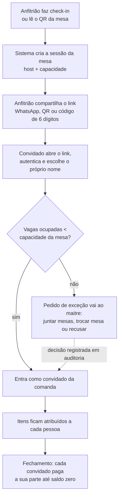
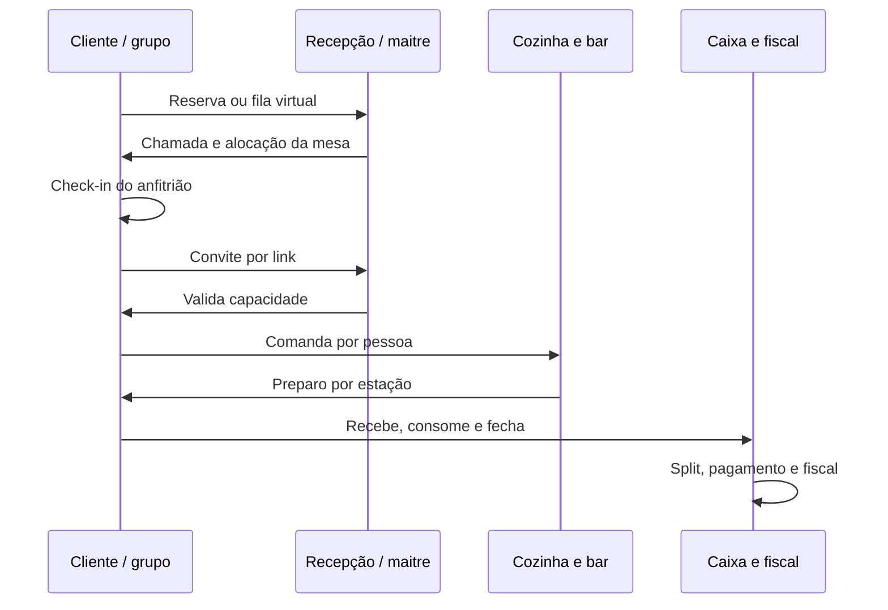
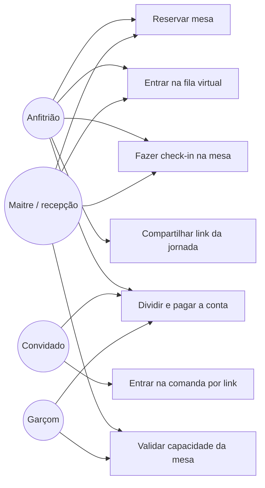
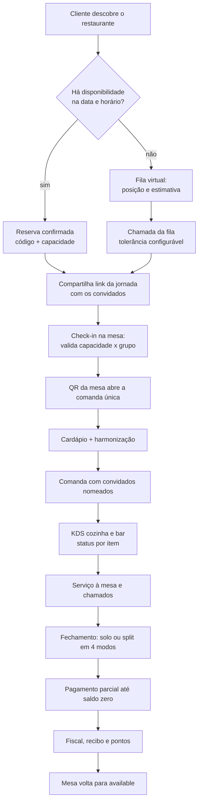
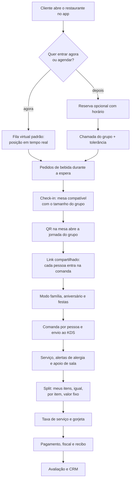
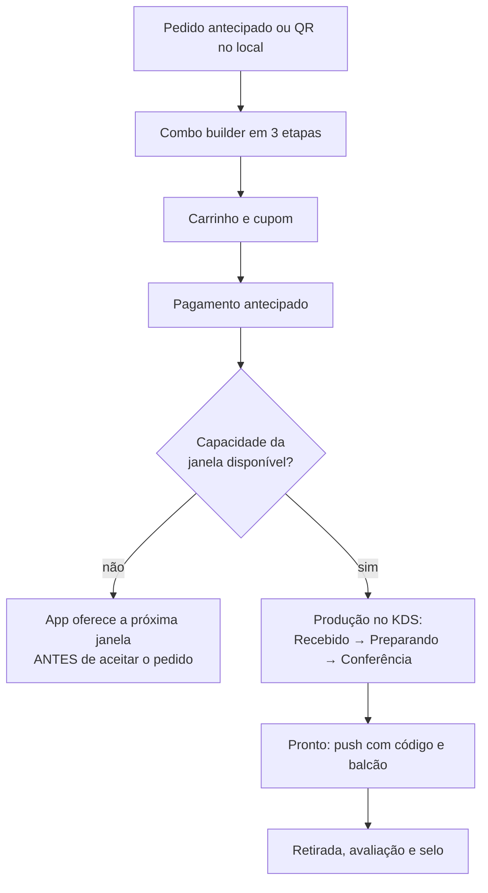

# Fluxos da spec, em texto

Os sete diagramas do documento original são imagens PNG (`diagramas/`). Um agente de código lê
mal imagens e não consegue fazer diff nelas. Abaixo, os mesmos fluxos transcritos em Mermaid —
**esta é a versão que deve ser lida e mantida**; os PNGs ficam como referência visual.

---

## 1. Amplitude dos modelos (spec §1.4)

> "Quanto mais amplo o modelo, mais módulos da jornada ficam ativos por padrão. O núcleo é o
> mesmo; muda o conjunto de módulos e as regras de fechamento."

| Fine Dining | Casual Dining | Quick Service |
|---|---|---|
| Reserva obrigatória | Fila virtual (preferencial) | Pedido antecipado |
| Fila virtual (fallback) | Reserva opcional | Combo builder |
| QR de mesa | QR de mesa | Pagamento antecipado |
| Convite por link | Convite por link | Preparo em 4 etapas |
| Comanda com convidados | Comanda por pessoa | Código de retirada |
| Chamados de sala | Modo família e festas | Cartão de selos |
| Split em 4 modos | Split em 4 modos | — |
| Pagamento no fim | Pagamento no fim | — |
| Fidelidade por níveis | — | — |

---

## 2. Fluxo de grupo — convite por link e check-in por capacidade (spec §2.6)

Vale para Fine Dining **e** Casual Dining.

**Regras que o diagrama carrega:** o link expira ao encerrar a conta; convidado que sai deixa
os itens na mesa; o anfitrião pode remover convidado antes do pedido.

---

## 3. Mapa de processo por raia — do convite ao pagamento (spec §2.6)

> **O estado da mesa muda em exatamente três pontos:** check-in (`occupied`), pedido confirmado
> (comanda ativa) e saldo zero (`available`). Qualquer outra escrita em `tables.status` é bug.

---

## 4. Casos de uso — jornada em grupo (spec §2.6)

---

## 5. Fluxograma — Fine Dining (spec §3)

Entrada por reserva obrigatória; fila virtual apenas como fallback controlado.

---

## 6. Fluxograma — Casual Dining (spec §4)

Entrada preferencial pela fila virtual; reserva opcional; QR de mesa como chave do grupo.

> Note que os itens pedidos na espera **migram para a comanda** no check-in, sem relançamento —
> é o critério de aceite da spec §4.6 e a razão de a fatia E2 depender de N2.

---

## 7. Fluxograma — Quick Service (spec §5)

Sem reserva e sem serviço à mesa: pagamento antecipado e retirada por código.

> A ordem aqui é a regra: **pagamento antes da produção** (protege a cozinha de pedidos
> fantasma, spec §5.4) e **verificação de capacidade antes de aceitar** — não depois.
